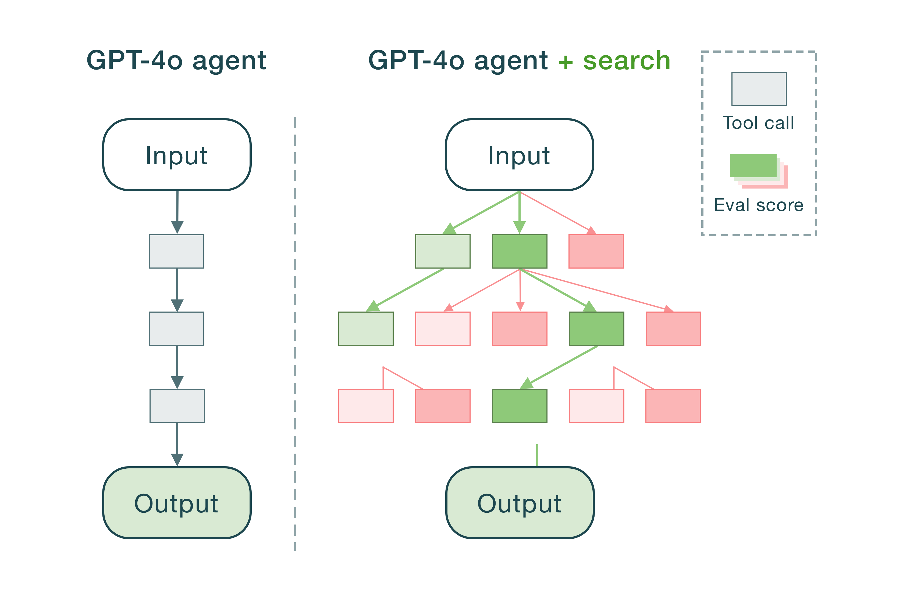

<div align="center">
  
</div>

---

**Saplings is a plug-and-play framework for building agents that use search algorithms to complete tasks.**

By incorporating search, an agent can explore different tool-use trajectories and find the optimal path. This ability to look multiple steps ahead reduces errors and boosts overall task performance –– especially on complex reasoning problems, like code generation or navigating a website. With saplings, you can build search into your agents with just a couple lines of code.

- Supports popular search algorithms: **Monte Carlo Tree Search (MCTS), A\*, and greedy best-first search**
- Uses OpenAI function calling under the hood
- Full control over the evaluation function, prompts, search parameters, etc.



**Why add search?**

Chain-of-thought/ReAct-style agents don't work well because they're vulnerable to compounding errors. Even a small mistake early in the loop can snowball and ruin the final output. Adding tree search gives your agent lookahead and backtracking abilities, making it easier to recover from such mistakes. And as compute becomes cheaper, it will become table stakes for agents to use inference-time search.

---

- [Installation](#installation)
- [Quickstart](#quickstart)
  - [Creating a tool](#creating-a-tool)
  - [Creating an agent](#creating-an-agent)
- [Docs](#docs)
  - [Search algorithms](#search-algorithms)
    - [Monte Carlo Tree Search](#monte-carlo-tree-search)
    - [A\*](#a*)
    - [Greedy best-first](#greedy-best-first)
    - [Hyperparameters](#hyperparameters)
  - [Custom evaluators](#custom-evaluators)
  - [Understanding agent output](#understanding-agent-output)
- [Roadmap](#roadmap)

## Installation

```bash
$ pip install saplings
```

## Quickstart

Below is a simple agent equipped with a tool for multiplying two numbers together. It can solve some tricky multiplication problems using Monte Carlo Tree Search (MCTS) under the hood.

```python
from saplings.examples import MultiplicationTool
from saplings.llms import OpenAI
from saplings import AStarAgent, Evaluator

model = OpenAI(model="gpt-4o", api_key="YOUR_API_KEY")
evaluator = Evaluator(model)
tools = [MultiplicationTool()]

agent = MonteCarloAgent(tools, model, evaluator)
messages, _, _ = agent.run("Let x = 9418.343 * 8.11 and y = 2x. Calculate (xy)(x^2).")
```

Let's break this down and walk through how to create your own tools and customize an agent.

### Creating a tool

Tools are what your agent will use to perform a task or answer a query. Each tool must extend the `Tool` base class and implement a few variables and methods. In our example, we'll make a simple tool that multiplies two numbers together:

```python
from saplings.abstract import Tool

class MultiplicationTool(Tool):
   def __init__(self, **kwargs):
      self.name = "multiply"
      self.description = "Multiplies two numbers and returns the result number."
      self.parameters = {
         "type": "object",
         "properties": {
            "a": {
               "type": "number",
               "description": "The number to multiply."
            },
            "b": {
               "type": "number",
               "description": "The number to multiply by."
            }
         },
         "required": ["a", "b"],
         "additionalProperties": False
      }
      self.is_terminal = False

   def format_output(self, output: any):
      return f"The result is: {output}"

   async def run(self, a: float, b: float, **kwargs):
      return a * b
```

If you've used [OpenAI function calling](https://platform.openai.com/docs/guides/function-calling) before, some of this should be familiar to you.

**Variables:**

* `name` (str): Name of the tool.
*  `description` (str): Description of what the tool does and when to call it.
* `parameters` (dict): Arguments for the tool as a JSON schema.
* `is_terminal` (bool): If `True`, calling this tool will terminate a search trajectory. Typically used for tools that generate a final output for the user (e.g. an answer to a question), or perform some other terminal action from which no further tool calls can be made.

**`run()` method:**

This is what actually executes the tool when the agent calls it. This should have the same arguments as the input parameters defined in the tool schema.

TODO: Mention that the current search trajectory gets passed into every `run` call and can be accessed via `kwargs["trajectory"]`.

**`format_output()` method (optional):**

This method is _optional_ and more of an advanced feature. This controls how the output of a tool call is presented to the model. By default, the output of `run()` is shown to the model. But in our example above, instead of seeing a number N, the model will see "The result is N".<!--This is useful if ...-->

The unformatted output of the tool is still stored in the agent's memory, and can be accessed in the `Message` objects returned by the agent. More on that [here](#

### Creating an agent

The first step here is choosing a model to govern the agent. Saplings only supports OpenAI right now, but Anthropic and Groq are on the [roadmap](#roadmap).

```python
from treeact.llms import OpenAI

model = OpenAI(model="gpt-4o", api_key="YOUR_API_KEY") # Defaults to os.getenv("OPENAI_API_KEY") if empty
```

The next step is to create an evaluator. This is what will compute the value function that guides the search. Generate a score between 0 and 1 for a given search trajectory. The score indicates

2. Choose an evaluator (mention threshold)
3. Choose a search algorithm

### Creating your agent

Once you've selected a model and your tools are ready, you can simply plug them into a `TreeAct` agent. There are multiple agents you can choose from, each with their own tree search algorithm: `GreedyAgent` and `AStarAgent` (`MonteCarloAgent` is still under development). Each have their own advantages and disadvantages.

#### `BFSAgent`

Implements a greedy breadth-first search. This agent will generate a set of candidate actions, self-evaluate each one, and then pick the best one to explore. It will repeat this until a termination condition is met. `GreedyAgent` is the fastest and cheapest agent, but also is incapable of backtracking if it goes down the wrong reasoning path.

```python
from treeact import BeamSearchAgent

model = OpenAI(api_key="YOUR_OPENAI_KEY", model="gpt-4o")
tools = [CalculatorTool()]

agent = BeamSearchAgent(tools, model)
```

<!--TODO: Don't list parameters here. Link to docstring for more details. "You can control hyperparameters for the algorithm. Learn more here.-->

**Parameters:**

1. `depth` (int): Maximum depth of the search tree, indicating how many levels the agent can explore.
2. `b_factor` (int): Branching factor. Specifies the number of potential next actions (i.e. tool calls) to generate at each step in a trajectory.
3. `beam_width` (int): Number of candidates actions that are explored in a given level of the tree. If `beam_width == b_factor` then this becomes a breadth-first search that explores _all_ nodes in a level.

#### `AStarAgent`

Implements a variation of the A\* pathfinding algorithm, based on the technique described in [Tree Search for Language Model Agents (Koh et al.).](https://arxiv.org/abs/2407.01476) Unlike `GreedyAgent`, this agent is potentially slower and more expensive, but is capable of backtracking and recovering from mistakes. `AStarAgent` is a good middle ground between `GreedyAgent` (dumb but fast) and `MonteCarloAgent` (smart but slow).

```python
from treeact import AStarAgent

model = OpenAI(api_key="YOUR_API_KEY", model="gpt-4o")
tools = [CalculatorTool()]

agent = AStarAgent(tools, model)
```

**Parameters:**

1. `depth` (int): Maximum depth of the search tree, indicating how many levels the agent can explore.
2. `b_factor` (int): Branching factor. Specifies the number of potential next actions (i.e. tool calls) to evaluate at each step in a trajectory.
3. `budget` (int or None): Search budget. This defines the maximum number of nodes (i.e. tool calls) allowed in the search tree before the search is terminated. If `None`, the `depth` and/or `threshold` are used as a termination condition.
4. `threshold` (float): A cutoff value for the value function. If the output exceeds this threshold, the search halts, and the current trajectory is accepted.

#### `MonteCarloAgent`

This technique is the SOTA among search-enabled language agents. It also requires the most compute, so be wary. AStarAgent is enough for many use cases.

TODO: Allow users to specify if tool calls are required or not. If they are, it's recommended to specify at least one tool as `is_terminal` indicating that if it's called, that means the agent must answer the query or has completed the task. If they aren't, then the agent will eitehr call a tool or generate a response.

### Running your agent

1. `run` method
2. Stream
3. Stream steps
4. Sync vs. async

## Advanced usage

In addition to the parameters listed above, every `TreeAct` agent also has the following parameters:

1. `prompt` (str): Prompt that governs the agent, i.e. instructions for calling tools. See the default value [here.]()
2. `eval_function` (Func[Trajectory, float]): Evaluation function. Takes a candidate tool-use trajectory as input and returns a score between 0-1 indicating the desirability of the trajectory. Used as a heuristic to guide the search algorithms. Default function is a LLM prompted to generate a score.
<!--3. `b_function` (Func[Trajectory, List[Message]]): Branching function. Coming soon.-->

---

> Note: In some cases, you may want to access the output of a previous tool call in this function. You can do this using the `state` keyword argument that is automatically passed into every `run` call (i.e. `kwargs.get("state")`). This input is a `State` object that contains all the previous tool calls in the current branch of the search tree. More about this object later.

---

TODO:

1. Generate multiple root nodes in beginning of MCTS.
2. Try keeping the evaluations in the message trajectory.
3. Make diagrams for each agent (and replace GIF with a diagram?).
4. Change name to saplings.
5. Add support for yielding steps (`iter_run`).
6. Add a `llm_call_budget` parameter to each agent.

With function-calling agents, there's two ways for the agent to _terminate._ That is, to generate a response to the user's query. One is to include a tool that, when caled, generates the final response. The other is to make tool-use optional and let the model decide when to generate a final response. The former approach is recommended for use with search ...

(See how to enable streaming for the final response)<!--You'll need to make the GenerateFinalResponse tool not do anything. Then actually generate the response outside of the agent.-->

### Search termination

Typically there are two types of agents. One takes an input from the user, like a query, performs some steps and then generates a response to the input. An example here is a Q&A agent that uses tools to search the web, find context, and then generate an answer. The other type of agent is given a _task_ rather than a query, and performs some steps but doesn't generate a final response. An example here is a web agent that interacts with a website.

For the first kind, there are two ways for the agent to _terminate._ That is, to generate a response to the user's query.

For the second kind, termination simply occurs when the evaluator scores a trajectory above a certain threshold.

## Roadmap

1. Support for chat history
2. Support for Anthropic and Groq models
3. Allow dynamic system prompts and tool schemas (i.e. prompts that change as the agent progresses)
4. Support for vision agents
5. Implement more heuristic search algorithms

**Mission:** Research has shown that scaling inference-time compute boosts agent capabilities. As models are getting cheaper and faster, techniques like tree search will become more viable in production settings. Saplings should be make it as easy as possible to build production-ready agents that use search.
