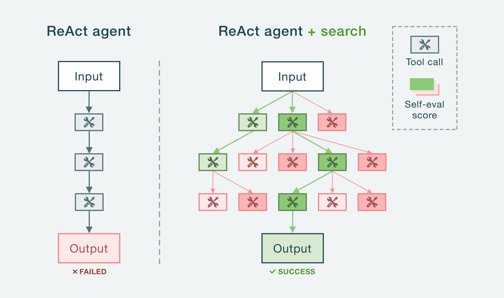

# 🌳 Saplings

**Saplings lets you build agents that reason using tree search.**

Think of this as _tree-of-thoughts_ meets _tool use._ With tree search, an agent can explore and evaluate different tool-use trajectories before choosing the optimal path. This ability to look multiple steps ahead and backtrack reduces mistakes and boosts reasoning compared to traditional CoT/ReAct-style agents.

Agents that use tree search achieve SOTA on tasks like:

- **Coding:** [92.7% on HumanEval](https://arxiv.org/pdf/2310.04406) using MCTS
- **Q&A/RAG:** [63% on HotPotQA](https://arxiv.org/pdf/2310.04406) using MCTS
- **Web Navigation:** [26.4% on VisualWebArena](https://arxiv.org/pdf/2407.01476) using A\*

<!--TODO: Show the before and after tree search scores on the tasks listed above-->

**Features:**

- Plug-and-play. Build a smarter agent with just a couple lines of code.
- Supports popular search algorithms: Monte Carlo Tree Search (MCTS), A\*, and greedy best-first search.
- Uses function calling under the hood.
- Customize the value function, prompts, search parameters, etc.
- Supports 100+ LLMs (via LiteLLM).



<!--Traditional agents fail because they can't recover from mistakes. Even a small error early in the loop can snowball and ruin the final output.-->

<!--TODO: Build a simple visualizer like this: https://www.llm-reasoners.net/visualizer/709cb8d3-f6da-49be-b705-549fbfc44bf9?accessKey=b5681f71 -->

---

- [Installation](#installation)
- [Quickstart](#quickstart)
  - [Creating a tool](#creating-a-tool)
  - [Configuring an agent](#configuring-an-agent)
- [Docs](#docs)
  - [Agents](#agents)
    - [Parameters](#parameters)
    - [MonteCarloAgent: Monte Carlo tree search](#montecarloagent-monte-carlo-tree-search)
    - [AStarAgent: A\* search](astaragent-a-search)
    - [GreedyAgent: Greedy best-first search](#greedyagent-greedy-best-first-serach)
    - [COTAgent: Chain-of-thought (no search)](#cotagent-chain-of-thought-no-search)
  - [The `Message` object](#the-message-object)
  - [Termination conditions](#termination-conditions)
  - [Advanced tool options](#advanced-tool-options)
    - [Accessing agent memory](#accessing-agent-memory)
    - [Reformatting tool output](#reformatting-tool-output)
  - [Custom evaluators](#custom-evaluators)
- [Roadmap](#roadmap)

## Installation

```bash
$ pip install saplings
```

## Quickstart

<!--Let's build an agent that uses a web search tool to complete tasks. Our agent will be equipped with Monte Carlo Tree Search (MCTS) as a reasoning algorithm.

```python
from saplings.examples import WebSearchTool
from saplings import MonteCarloAgent, Evaluator, OpenAI

model = OpenAI(model="gpt-4o")
evaluator = Evaluator(model)
tools = [WebSearchTool()]

agent = MonteCarloAgent(tools, model, evaluator)
messages, _, _ = agent.run("Create a table comparing ancient astronomical tools with their origin, accuracy, and modern equivalents.")
```-->

Below is a simple agent implementing Monte Carlo tree search (MCTS). It's equipped with a multiplication tool to solve tricky arithmetic problems.

```python
from saplings.examples import MultiplicationTool
from saplings import MonteCarloAgent, Evaluator, Model

model = Model(model="openai/gpt-4o") # Wraps LiteLLM
evaluator = Evaluator(model)
tools = [MultiplicationTool()]

agent = MonteCarloAgent(tools, model, evaluator)
messages, _, _ = agent.run("Let x = 9418.343 * 8.11 and y = 2x. Calculate (xy)(x^2).")
```

This is the "bare minimum" for setting up a search agent with saplings –– just a few lines of code. There are a lot more parameters you can control, all covered in the [docs](#docs). But let's first walk through the basics of creating your own tools and configuring an agent.

### Creating a tool

Tools are what your agent will use to perform a task or answer a query. Each tool must extend the `Tool` base class and implement a few variables and methods. Here's an example of a simple tool that multiples two numbers together:

```python
from saplings.abstract import Tool

class MultiplicationTool(Tool):
   def __init__(self, **kwargs):
      self.name = "multiply"
      self.description = "Multiplies two numbers and returns the result number."
      self.parameters = {
         "type": "object",
         "properties": {
            "a": {
               "type": "number",
               "description": "The number to multiply."
            },
            "b": {
               "type": "number",
               "description": "The number to multiply by."
            }
         },
         "required": ["a", "b"],
         "additionalProperties": False
      }
      self.is_terminal = False

   async def run(self, a, b, **kwargs):
      return a * b
```

**Variables:**

The instance variables in the class tell the agent when and how to call the tool. If you've used [OpenAI function calling](https://platform.openai.com/docs/guides/function-calling) before, most of this should be familiar to you.

- `name` (str): Name of the tool.
- `description` (str): Description of what the tool does and when to call it.
- `parameters` (dict): Arguments for the tool as a JSON schema.
- `is_terminal` (bool): If `True`, calling this tool will terminate a search trajectory –– meaning, no subsequent tools can be called after this one. This is typically used for tools that generate a final output for the user (e.g. an answer to a question). More on this [here.](#termination-conditions)

**`run()` method:**

This is what actually executes the tool when the agent calls it. Arguments should be the same as the input parameters in the tool schema.

**Advanced options:**

There are additional things you can do with tools, such as accessing the agent's memory during tool execution, or controlling how tool output is shown to the model (vs. how it's stored in memory). You can read about these options [here.](#advanced-tool-options)

### Configuring an agent

**Choosing a model:**

Saplings wraps LiteLLM to provide access to 100+ LLMs. Choose a model from their [list of supported providers](https://docs.litellm.ai/docs/providers) and create a `Model` object with it:

```python
from saplings import Model

model = Model("openai/gpt-4o")
```

Note: any additional `kwargs` will be passed down to all the LiteLLM completion calls.

**Setting up the evaluator:**

This is what will guide the search process. The evaluator takes a search trajectory (i.e. a list of OpenAI-style messages) and returns a score between 0 and 1, indicating how promising the trajectory is. By default, a score of `1.0` means the agent has _solved_ the problem and can terminate the search. You can change the solution cutoff by setting the `threshold` parameter in the agent –– more on that [here](#parameters).

```python
from saplings import Evaluator

evaluator = Evaluator(model)
```

The default evaluator provided by saplings uses a LLM (i.e. the `model` you pass in above) to score trajectories. The `Evaluator` object has parameters that let you control things like the system prompt used and the sampling rate. You can also define your own custom evaluator if necessary. Read more about evaluators [here](#custom-evaluators).

**Choosing an agent/search algorithm:**

Once your tools, model, and evaluator are ready, you can simply plug them into a saplings agent. There are multiple to choose from, each implementing their own tree search algorithm: `MonteCarloAgent`, `AStarAgent`, and `GreedyAgent`. There's also a regular chain-of-thought agent available, `COTAgent`, which does not implement any search. Each agent has their own advantages and disadvantages, which you can read about [here](#agents).

```python
from saplings import MonteCarloAgent

agent = MonteCarloAgent(tools, model, evaluator)
```

This will initialize your agent. To actually run it on an input, call the `run` method. To run it asynchronously, call the `run_async` method.

```python
messages, score, is_solution = agent.run("What's 2 * 2?") # await agent.run_async("What's 2 * 2?")
```

The output is a list of messages representing the best tool-use trajectory, the final score of the trajectory (as given by the evaluator), and whether or not the search terminated because the evaluator deemed the trajectory a _solution_ to the prompt. The messages are [`Message` objects,](#the-message-object) which are special objects native to saplings that wrap OpenAI messages.

Notably, there are [many more parameters](#parameters) you can set for the agent, such as the system prompt that governs it.

## Docs

### Agents

#### Parameters

Every agent in saplings has the same parameters, listed below:

1. `tools` (List[Tool]): List of tools your agent can use.
2. `model` (Model): LLM provider that your agent will use to call tools.
3. `evaluator` (BaseEvaluator): Evaluation function that the agent will use to guide the search process.
4. `prompt` (str): System prompt for the agent.
5. `b_factor` (int): Branching factor, i.e. the number of potential next tool calls to evaluate at each step in a search trajectory. Note that this parameter does not do anything for `COTAgent`.
6. `max_depth` (int): Maximum depth of the search tree, indicating how many levels the agent can explore.
7. `threshold` (float): A cutoff value for the evaluation function. If a trajectory's evaluation score is above this threshold, the search will terminate and that trajectory will be accepted as the solution.<!--TODO: Note the exception here-->
8. `verbose` (bool): Whether to print logging statements when you run the agent.
9. `tool_choice` ("auto" | "required"): Same as the `tool_choice` parameter in the OpenAI chat completions function. Indicates whether the model must _always_ call a tool, or if it can decide to generate a normal response instead.<!--TODO: Note that this changes the termination behavior of the agent-->
10. `parallel_tool_calls` (bool): Same as the `parallel_tool_calls` parameter in the OpenAI chat completions function. Indicates whether the model can generate _multiple_ tool calls in a single completion request.

#### GreedyAgent: Greedy best-first serach

This agent implements a greedy best-first search. It's the fastest and cheapest search agent, in terms of LLM calls, but it's also incapable of backtracking, thus making it the least effective agent. `GreedyAgent` works by taking the input and generating a set of candidate tool calls. It executes each tool call and evaluates their outputs. Then, it picks the best tool call based on its evaluation and generates a set of candidate _next_ tool calls. It repeats this process until a termination condition is met.

#### MonteCarloAgent: Monte Carlo tree search


This agent implements the Monte Carlo tree search (MCTS) algorithm, based on the paper [Language Agent Tree Search (Zhou, et. al).](https://arxiv.org/pdf/2310.04406) It is the most effective agent you can build with saplings, but also the slowest and most expensive (in terms of LLM calls) in the worst case. The primary advantage of this agent is its ability to balance exploration and exploitation, allowing it to efficiently find optimal trajectories by using past experiences and adjusting its strategy accordingly.

Note that, besides the parameters [listed above](#parameters), this agent has one additional parameter:

1. `max_rollouts` (int, default = 10): This controls the maximum # of simulations the agent can perform.

#### AStarAgent: A\* search


Implements a variation of the A\* pathfinding algorithm, based on the paper [Tree Search for Language Model Agents (Koh, et al.).](https://arxiv.org/abs/2407.01476) Unlike `GreedyAgent`, this agent makes more LLM calls in the worst case, but is capable of backtracking and recovering from mistakes. However, unlike `MonteCarloAgent`, it does not update its search strategy based on the trajectories it has already explored. Oftentimes, `AStarAgent` is the perfect middle-ground between `GreedyAgent` (dumb but fast) and `MonteCarloAgent` (smart but slow).

#### COTAgent: Chain-of-thought (no search)

This is a standard tool-calling agent and does not implement any search. It takes an input, calls a tool, then uses the tool output to inform the next tool call, and so on until a termination condition is met. Think of `COTAgent` as a baseline to compare your search agents to.

### The `Message` object

[Messages](https://github.com/shobrook/saplings/blob/master/saplings/dtos/Message.py) are a core data structure in saplings. They are essentially equivalent to OpenAI messages (e.g. user input, tool calls, tool responses, assistant responses), with a few extra properties and helper methods. A list of messages represents a search trajectory. When you run an agent, it will return a list of messages representing the best trajectory it found.

Saplings messages can be easily converted into OpenAI-style messages using the `to_openai_message()` method.

```python
messages, _, _ = agent.run("This is my prompt!")
messages = [message.to_openai_response() for message in messages]

print(messages)
# [{"role": "user", "content": "This is my prompt!"}, ..., {"role": "assistant", "content": "This is a response!"}]
```

Message objects have only one additional attribute that OpenAI messages don't have. If a message represents a tool response, it will have a `raw_output` property that contains the output of that tool. What's stored here [may be different than](#reformatting-tool-output) the tool response that gets shown to the model, which is stored in the `content` property.

### Termination conditions

Every tool has an `is_terminal` property. This is a boolean flag that tells the agent if calling the tool should terminate a search trajectory. If it's `True`, no subsequent tool calls can be made after the tool is invoked, and the agent will terminate that search trajectory. Terminal tools are typically used to generate some sort of final output for the user (e.g. an answer to a question).

We say that an agent can _self-terminate_ if it has at least one terminal tool, OR if the `tool_choice` parameter is set to "auto." In the latter case, this means that calling a tool is _optional_ for the agent, and instead of a tool call, it can generate a regular assistant response to the input prompt. We consider such a response to also terminate a search trajectory.

If an agent cannot self-terminate, then a search trajectory will only ever terminate if either a maximum depth is reached (set by the `max_depth` parameter), or the evaluator marks a trajectory as _solved_ (i.e. the score is >= the agent's `threshold` parameter) –– in which case the entire search itself terminates.

An important point of confusion here: even if an evaluator marks a trajectory as solved, the search may not terminate if the agent can self-terminate. This happens when a trajectory ends with a _non-terminal_ tool call (or a non-assistant response, in the case when tool use is optional) but is still given a score above the solution threshold. In this case, the search will continue unless until a terminal state is reached that is marked as solved. If no terminal state is ever reached, the trajectory with the best score is returned. If no solution is ever found, and there is one trajectory with a terminal state and another with a non-terminal state but a higher score, the terminal trajectory is preferred and returned.

<!--### Streaming

Let's say you're building a Q&A agent and its equipped with a _terminal_ tool that generates a final answer when called. During the search process, this tool may be called _multiple_ times before the search terminates. In these cases, if your tool streams the output to the user, the user will get multiple streams until a final one is...-->

### Advanced tool options

#### Accessing agent memory

In some cases, running your tool may depend on the output of the previous tools your agent has used, or the user input itself. If this is the case, you can access the agent's current search trajectory in the `run` method when you implement your tool. Simply use `kwargs.get("trajectory")`. This will return a list of [Message](#the-message-object) objects, which are wrappers around OpenAI messages.

#### Reformatting tool output

In some cases, it makes sense for the raw output of a tool to be separated from the output that's shown to the model. By default, the output of `run()` is what's shown to the model. But you can add the _optional_ `format_output` method to your tool class to change how the output is presented to the agent. For example, in our quickstart example, instead of seeing the multiplication result N, you might want the model to see "A \* B = N" so the agent can more easily keep track of what numbers have been multiplied. Here's how you'd modify the tool to do that:

```python
from saplings.abstract import Tool

class MultiplicationTool(Tool):
   ...

   async def run(self, a, b, **kwargs):
      return {"a": a, "b": "result": a * b}

   def format_output(self, output):
      a, b = output['a'], output['b']
      result = output['result']
      return f"{a} * {b} = {result}"
```

The unformatted output of the tool is still stored in the agent's memory. It can be access via the `raw_output` property of the [Message](#the-message-object) object that represents the tool response.

### Custom evaluators

Every agent implements a _heuristic search algorithm,_ meaning that it uses some heuristic or value function to guide the search. By default, saplings offers the `Evaluator` object, which evaluates a search trajectory using a LLM. It takes a trajectory (i.e. a list of OpenAI messages) as input and returns a score between 0 and 1 which tells the agent if its on the right track or not, along with some written justification for the score.

The `Evaluator` object has the following parameters:

1. `model` (Model): The LLM used to generate the score.
2. `n_samples` (int): The number of scores to generate for a given trajectory. Equivalent to the `n` parameter in an OpenAI chat completion. If it's greater than 1, multiple candidate scores will be generated for a given trajectory and then averaged to return the final score. Making this greater than 1 is equivalent to enabling [self-consistency](https://arxiv.org/pdf/2203.11171) in the evaluation process.
3. `prompt` (str): The system prompt that tells the model how it should evaluate a trajectory and generate a score.

In most cases, simply customizing this object will be sufficient, but in some situations it makes sense to build your own evaluator. For example, if you're building a coding agent, you may want to evaluate a search trajectory using some external feedback, such as whether the code compiles or whether a set of unit tests are passing. To build a custom evaluator, you must extend the `Evaluator` base class and implement a `run` method. This method must take in a list of [Message](#the-message-object) objects as input, representing a search trajectory, and return an [`Evaluation` object](https://github.com/shobrook/saplings/blob/master/saplings/dtos/Evaluation.py) as output. This object has two properties: `score` (a value between 0 and 1) and `reasoning` (an _optional_ string with written justification for the score).

```python
from saplings.abstract import Evaluator
from saplings.dtos import Evaluation

class CustomEvaluator(Evaluator):
   def __init__(self):
      pass

   async def run(self, trajectory: List[Message]) -> Evaluation:
      # Implement this
      return Evaluation(score=1.0, reasoning="Justification goes here.")
```

Note that the trajectory will always contain the original input message, every tool call, and every tool response. For the tool responses, you can access the raw output of the tool using the `Message.raw_output` property, discussed in more detail [here.](#reformatting-tool-output)

Each agent has a `threshold` parameter, which determines the minimum score at which to terminate the search and deem a trajectory as a _solution._ By default, it is 1.0, so you should keep this in mind when designing your evaluator.

## Roadmap

1. Support for chat history
2. Support for vision agents
3. Add an `llm_call_budget` parameter to every agent

In general, as inference gets cheaper and faster, it will become table stakes for agents to use search.

## Note from the author

One of my other open-source packages used to be called saplings. It has since been renamed to [syntaxis](https://github.com/shobrook/syntaxis) and is now associated with the package of the same name on PyPi.
